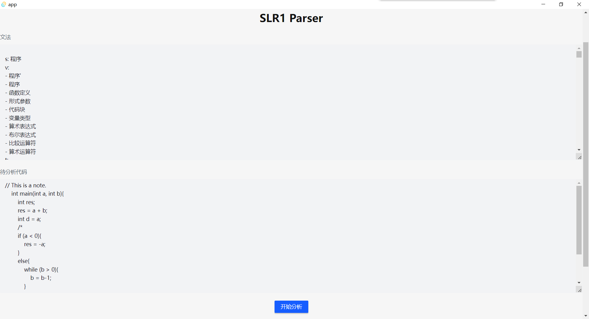
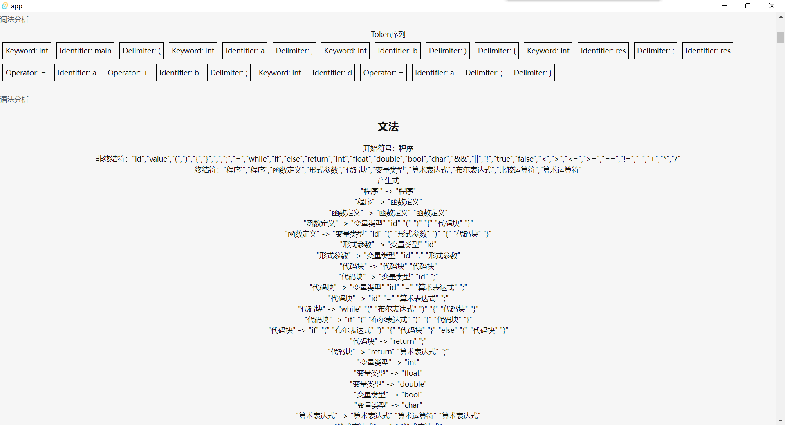
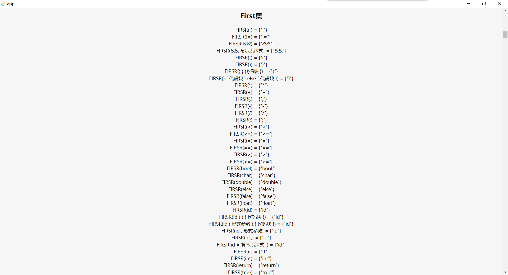
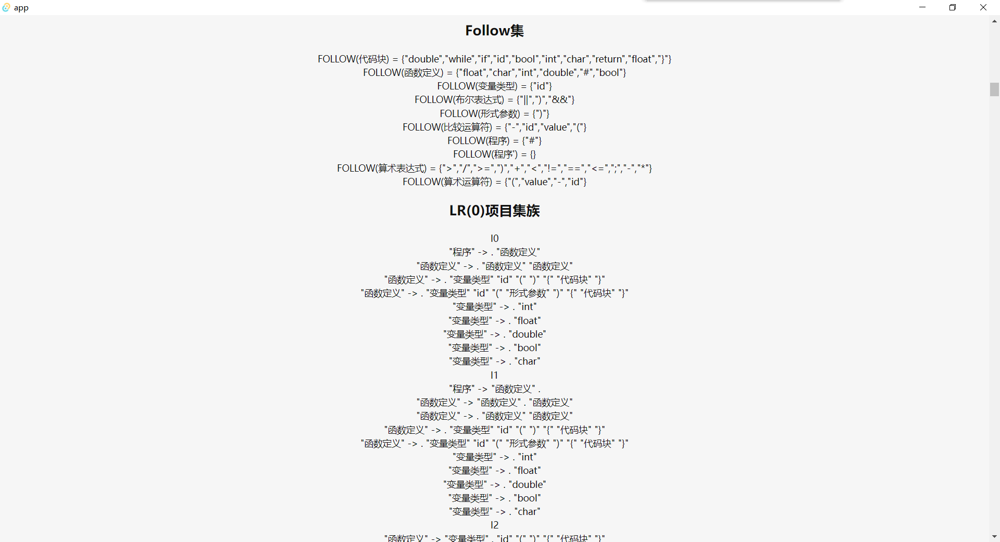
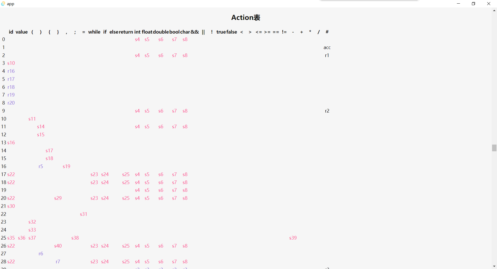
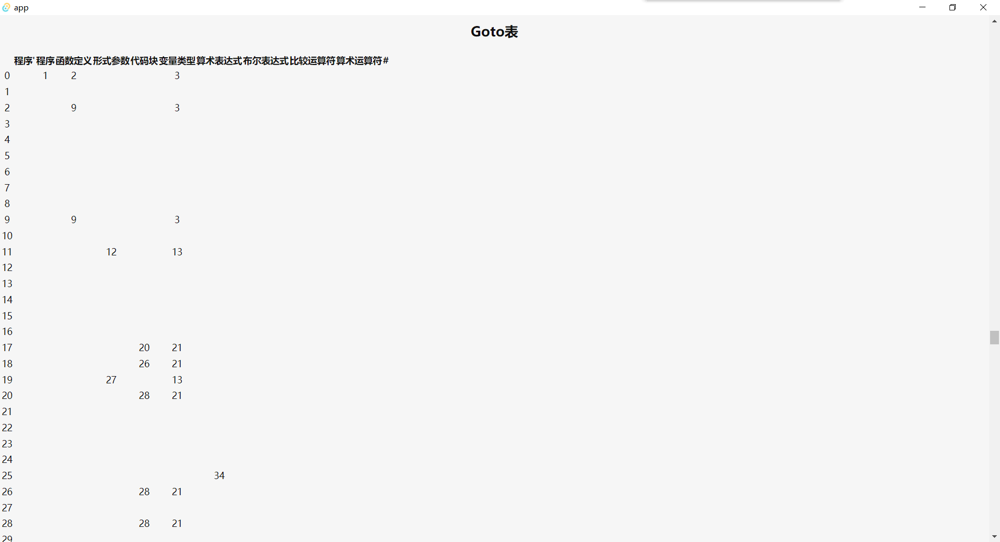
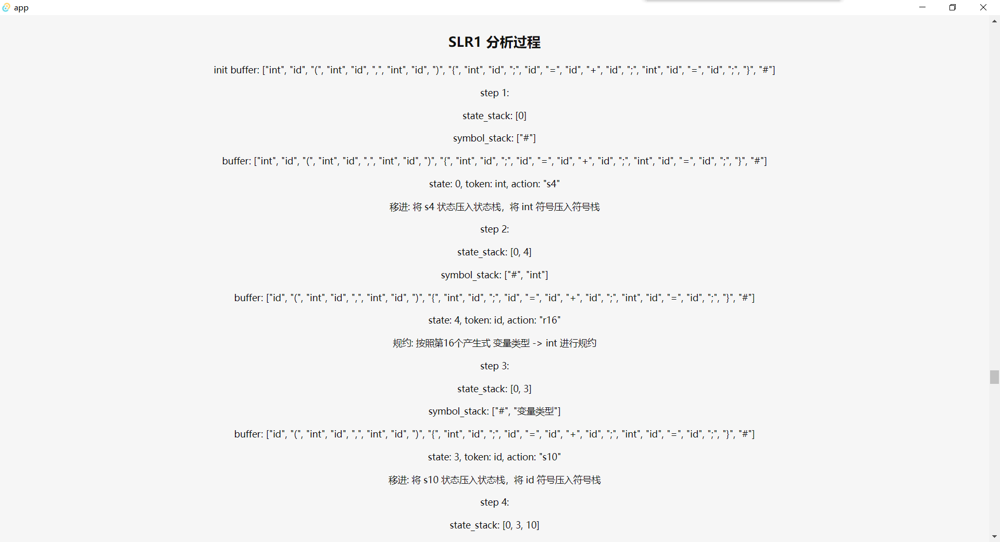

# SLR(1) Parser

这是一个用rust编写的SLR(1)分析器。

GUI采用tauri，但由于某些铸币😰操作，tauri界面的源码全部丢失，留下来的只有一个安装包😭😭😭。

感谢大佬的[yafeng19](https://github.com/yafeng19)/**[SLR1-Parser](https://github.com/yafeng19/SLR1-Parser)**。本项目基本上完全仿照大佬项目编写இ௰இ。

## 使用

想使用tauri的GUI请下载`app_0.0.0_x64_en-US.msi`(只有windows版)并安装。

`src/parser`中包含了所有核心代码与~~基本完整的~~测试，使用方法应该看完测试就懂了。

本项目支持使用yml自定义用于分析的文法，示例在`grammar_example.yml`中。

💔注意：文法中最好不好包含`# ε`等特殊符号，可能会发生意想不到的错误。

## 预览

来看看被评价为神经衰弱的gui吧🤤🤤🤤

